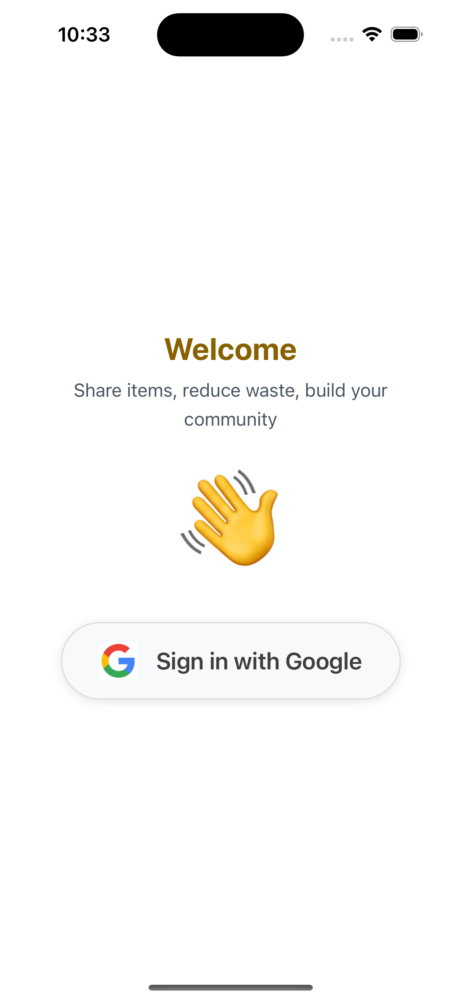
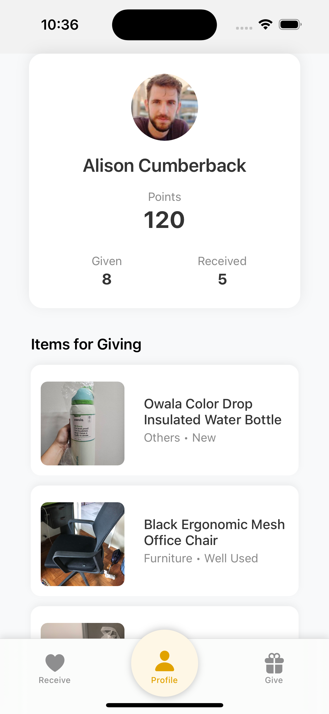
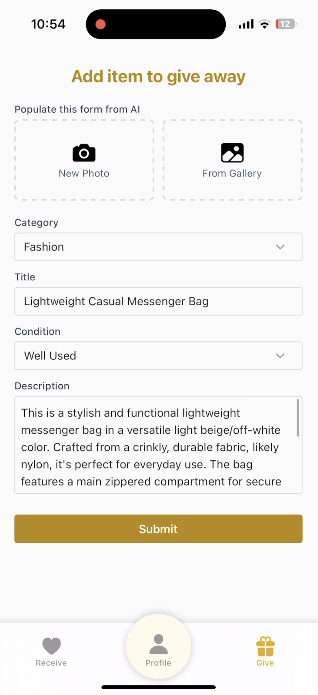
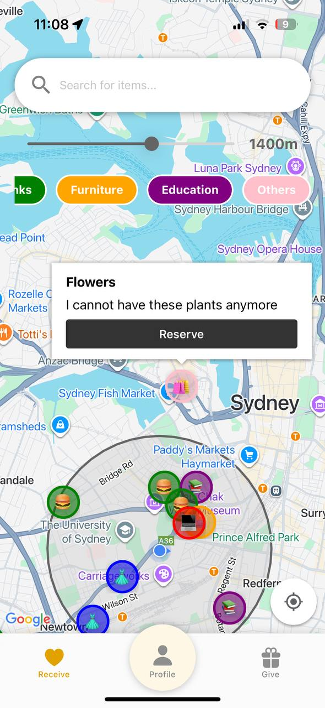
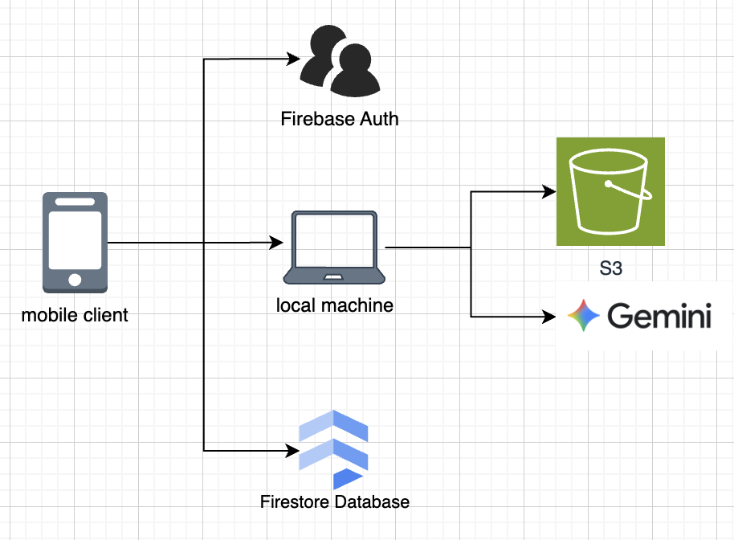

## EcoGive
The cities of the future will thrive on circularity, uniting human connection with the continual renewal of resources. As students, we often find ourselves surrounded by items we no longer need, especially when moving out of our accommodations after completing university. Throwing these items away feels wasteful, yet selling them on platforms like Facebook Marketplace can be inconvenient — it involves pricing, pitching, and sometimes even creating an account. At the same time, as students and young people, we often need everyday items but would rather not spend money on brand-new ones.  

**EcoGive** was born out of this shared experience, built on the belief in sharing over selling, and community over commerce. Our platform creates a space where people can easily **give away what they no longer need** and **receive what they do** without barriers. This helps reduce unnecessary purchases, prevents waste, and fosters **community spirit** by connecting people who help one another.

---

**EcoGive** directly ties into the **theme of "Cities of the Future"**. We envision future cities that are:  
- **Sustainable**, where resources are reused rather than discarded.  
- **Community-driven**, where people **collaborate and connect** rather than live in isolated, individualistic ways.  

## Features

**EcoGive** is a mobile app that enables people to **give away items they no longer need** and **receive things they need** - **completely free**.  

### Key Features:
- **Points System**: Users earn points whenever they give or receive items.
- **Profile Dashboard**: Tracks users’ total **points** and the number of items given and received, helping promote engagement.
- **Give Page**: Users can upload or capture item images and AI pre-fills the name, condition, category and description of the item. 
- **Receive Page**: Displays nearby available items using a **map-based view**, making it easy for users to explore what others are offering around them.
EcoDrive is a mobile application platform which 

  
  
  
  

## System Architecture
- Mobile client authenticates user with social login using Firebase Authentication.
- User data is fetched from Firestore NoSQL collection.
- User takes a picture and request from backend (local machine) for presigned url to upload to AWS S3
- The client sends a GET request to the backend, which uses Gemini AI to generate a structured response. This response is used to prefill the contents of the form.
   - Refer to [REDME.md](backend/README.md) for API Documentation 

## Configuration & Installation
### Backend
1. Copy `backend/.env.template` to `backend/.env`
2. Create project in Firebase and obtain [Gemini API Key](https://ai.google.dev/gemini-api/docs/api-key?gclsrc=aw.ds&gad_source=1&gad_campaignid=22184668741&gbraid=0AAAAACn9t66OtBIDuu5v2wEMpReIKyTtT&gclid=Cj0KCQjwwsrFBhD6ARIsAPnUFD1VAMj_nTHQtFwNgYLIghG6gO4zbYsM8EzFC_ScX5oQWcGPCACMneYaAoMoEALw_wcB).
3. Obtain AWS credentials from AWS console.
4. Connect to UniSydney WiFi. 
5. Check private IP assigned to machine by DHCP server. 
   - `ifconfig | grep "inet " | grep -v 127.0.0.1`
6. Host backend server on local machine by running `bash entrypoint.sh`
7. Assuming assigned private IP is 10.16.230.79. Use curl to verify service health. 
   - `curl --request GET --url http://10.16.230.79:3008/health`

### Frontend
1. Update backend hostname in `frontend/services/api.ts` with the private IP.
2. Copy `frontend/.env.template` to `frontend/.env`
3. Set up google social login according to [Expo Documentation](https://docs.expo.dev/guides/google-authentication/).
5. Start up expo server `npx expo start` and scan QR code with Expo Go on mobile device.

## License
This project is licensed under the MIT License. See [LICENSE](./LICENSE) for details.

## Contribution
Hackathon project by team foodie comprising of:
- Jodi Tan
- Jonas Lim
- Apurva Lohia